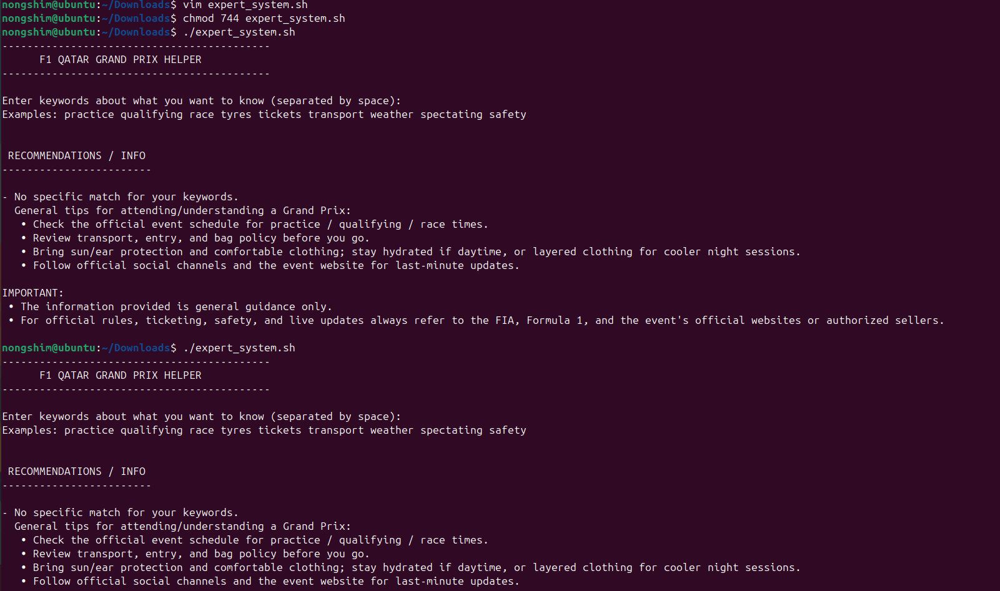

# F1 Qatar Grand Prix – Bash-Based Expert System

##  The objective of this lab exercise is to build a simple rule-based expert system using shell scripting. The expert system will provide recommendations based on a set of predefined rules.

### Output  


### Overview  
This script acts as a **rule-based expert assistant** for the **F1 Qatar Grand Prix** at the Lusail International Circuit.  
Users enter keywords (e.g., "race", "tyres", "qualifying", "transport", etc.) and the script generates relevant information or tips.

---

## Bash Script – F1 Qatar Grand Prix Helper

```bash
#!/bin/bash

display_header() {
    echo "-------------------------------------------"
    echo "      F1 QATAR GRAND PRIX HELPER"
    echo "-------------------------------------------"
    echo
}

get_keywords() {
    echo "Enter keywords about what you want to know (separated by space):"
    echo "Examples: practice qualifying race tyres tickets transport weather spectating safety"
    read -r user_input
    # normalize to lowercase
    keywords=$(echo "$user_input" | tr 'A-Z' 'a-z')
}

evaluate_rules() {
    local matched=false
    echo
    echo " RECOMMENDATIONS / INFO "
    echo "------------------------"
    echo

    # RULE: General Qatar/Losail info
    if [[ "$keywords" == *"qatar"* ]] || [[ "$keywords" == *"losail"* ]]; then
        echo "- Qatar / Losail Circuit:"
        echo "  • The Losail International Circuit is fast and modern; expect high-speed corners and strong brakes zones."
        echo "  • It's known for dramatic races and good overtaking opportunities at designated straights and braking points."
        matched=true
        echo
    fi

    # RULE: Practice
    if [[ "$keywords" == *"practice"* ]] || [[ "$keywords" == *"fp1"* ]] || [[ "$keywords" == *"fp2"* ]]; then
        echo "- Practice sessions:"
        echo "  • Practice is used by teams to fine-tune setup and tyre strategy — it's less about lap times and more about data-gathering."
        echo "  • Watch for long-run pace and tyre wear indicators."
        matched=true
        echo
    fi

    # RULE: Qualifying
    if [[ "$keywords" == *"qualifying"* ]] || [[ "$keywords" == *"q1"* ]] || [[ "$keywords" == *"q2"* ]] || [[ "$keywords" == *"q3"* ]]; then
        echo "- Qualifying tips:"
        echo "  • Qualifying position matters for clean air at Losail — good grid position helps avoid first-lap chaos."
        echo "  • Track evolution and temperature strongly affect lap times."
        matched=true
        echo
    fi

    # RULE: Race strategy / tyres
    if [[ "$keywords" == *"race"* ]] || [[ "$keywords" == *"strategy"* ]] || [[ "$keywords" == *"tyre"* ]] || [[ "$keywords" == *"tyres"* ]]; then
        echo "- Race strategy & tyres:"
        echo "  • Tyre wear is critical at Lusail due to long high-speed corners."
        echo "  • Undercut/overcut strategies can be decisive."
        echo "  • Sand on the track can reduce grip early in the weekend."
        matched=true
        echo
    fi

    # RULE: Weather / night race
    if [[ "$keywords" == *"weather"* ]] || [[ "$keywords" == *"wind"* ]] || [[ "$keywords" == *"sand"* ]] || [[ "$keywords" == *"night"* ]] || [[ "$keywords" == *"heat"* ]]; then
        echo "- Weather & track conditions:"
        echo "  • Qatar events can be affected by wind and sand — reducing grip and stability."
        echo "  • Evening temperatures increase grip as the night progresses."
        matched=true
        echo
    fi

    # RULE: Spectating / tickets / fan info
    if [[ "$keywords" == *"tickets"* ]] || [[ "$keywords" == *"spectator"* ]] || [[ "$keywords" == *"grandstand"* ]]; then
        echo "- Spectator & ticket tips:"
        echo "  • Buy tickets from verified sellers; check seat location and fan zone access."
        echo "  • Ear protection is recommended."
        matched=true
        echo
    fi

    # RULE: Transport / parking
    if [[ "$keywords" == *"transport"* ]] || [[ "$keywords" == *"parking"* ]] || [[ "$keywords" == *"shuttle"* ]]; then
        echo "- Transport & logistics:"
        echo "  • Allow extra travel time due to event traffic and security checks."
        echo "  • Check for shuttle buses or park-and-ride services."
        matched=true
        echo
    fi

    # RULE: Safety / incidents
    if [[ "$keywords" == *"safety"* ]] || [[ "$keywords" == *"crash"* ]] || [[ "$keywords" == *"incident"* ]]; then
        echo "- Safety & incidents:"
        echo "  • Follow marshals and FIA instructions."
        echo "  • Avoid entering restricted or unsafe areas."
        matched=true
        echo
    fi

    # RULE: Pitlane
    if [[ "$keywords" == *"pit"* ]] || [[ "$keywords" == *"pitstop"* ]]; then
        echo "- Pitlane & pitstop info:"
        echo "  • Pitstops are extremely fast and time-critical."
        echo "  • Access is restricted to authorized staff."
        matched=true
        echo
    fi

    # RULE: Track layout / overtaking
    if [[ "$keywords" == *"overtake"* ]] || [[ "$keywords" == *"layout"* ]] || [[ "$keywords" == *"corners"* ]]; then
        echo "- Overtaking & circuit layout:"
        echo "  • Main passing zones are on the start-finish straight and heavy braking corners."
        echo "  • DRS zones affect overtaking opportunities."
        matched=true
        echo
    fi

    # RULE: Broadcasting / how to watch
    if [[ "$keywords" == *"watch"* ]] || [[ "$keywords" == *"stream"* ]] || [[ "$keywords" == *"tv"* ]]; then
        echo "- Watching & broadcast:"
        echo "  • Check local broadcasters for session timing."
        echo "  • Verify time zone differences."
        matched=true
        echo
    fi

    # RULE: Entertainment / concerts / afterparty
    if [[ "$keywords" == *"afterparty"* ]] || [[ "$keywords" == *"concert"* ]] || [[ "$keywords" == *"entertainment"* ]]; then
        echo "- Events & entertainment:"
        echo "  • Many Grands Prix include concerts and fan-zone events."
        matched=true
        echo
    fi

    # Fallback
    if [[ "$matched" == false ]]; then
        echo "- No specific match found."
        echo "  • Check official event schedule."
        echo "  • Bring sun/ear protection; stay hydrated."
        echo "  • Follow event social media for last-minute updates."
        echo
    fi

    echo "IMPORTANT:"
    echo " • This script provides general guidance only."
    echo " • Always follow FIA, Formula 1, and official event sources for accurate information."
    echo
}

# Main
display_header
get_keywords
evaluate_rules
exit 0
-Designing clear and non-overlapping rules was challenging because some symptoms occur together 

- Handling free-text user input was difficult due to possible spelling mistakes.

- Making the input case-insensitive required additional processing using the tr command.

- Adding medication examples had to be done carefully to keep the system educational and not misleading.

- Ensuring that the fallback recommendation appears only when no rule matches required proper use of the matched variable.

 #### <h1 style="background-color: pink;">Observations Made</h1>

- The expert system correctly accepts user input and processes it successfully.

- Multiple rules can be matched when the user enters more than one symptom.

- The if conditional statements work effectively for rule evaluation.

- The system displays correct recommendations and medications for valid symptoms.

- The general recommendation is shown only when no specific rule matches.

- The script is simple, interactive, and easy to use.

#### <h1 style="background-color: pink;">Improvements That Can Be Made</h1>

- A menu-driven input system can be added to avoid spelling errors.

- Input validation can be introduced to handle invalid or empty input.

- A loop can be added to allow the user to run the expert system multiple times without restarting the script.

- Rules can be stored in an external file for easier modification and scalability.

- Logging user input and outputs to a file can be added for analysis and debugging.

- More health-related rules can be added to make the expert system more comprehensive.

### <h1 style="background-color: pink;"> CONCLUSION</h1> 

- The rule-based expert system was successfully implemented using shell scripting.

- The system accurately accepts user symptoms and provides appropriate recommendations.

- Conditional statements were effectively used to implement multiple medical rules.

- The inclusion of example medications made the system more informative and practical.

- The fallback general recommendation ensures that the system always provides guidance.
